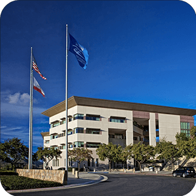

<!-- Improved compatibility of back to top link: See: https://github.com/othneildrew/Best-README-Template/pull/73 -->
<a name="readme-top"></a>
<!--
*** Thanks for checking out the Best-README-Template. If you have a suggestion
*** that would make this better, please fork the repo and create a pull request
*** or simply open an issue with the tag "enhancement".
*** Don't forget to give the project a star!
*** Thanks again! Now go create something AMAZING! :D
-->


<!-- PROJECT SHIELDS -->
<!--
*** I'm using markdown "reference style" links for readability.
*** Reference links are enclosed in brackets [ ] instead of parentheses ( ).
*** See the bottom of this document for the declaration of the reference variables
*** for contributors-url, forks-url, etc. This is an optional, concise syntax you may use.
*** https://www.markdownguide.org/basic-syntax/#reference-style-links
-->
[![Contributors][contributors-shield]][contributors-url]
[![Forks][forks-shield]][forks-url]
[![Stargazers][stars-shield]][stars-url]
[![Issues][issues-shield]][issues-url]
[![MIT License][license-shield]][license-url]
[![LinkedIn][linkedin-shield]][linkedin-url]


<!-- PROJECT LOGO -->
<br />
<div align="center">
  <a href="https://github.com/SalmanBurhan/csusm-studyroom-reserver-fall-2022">
    
  </a>

<h3 align="center">Fall 2022<br/>Study Room Reserver</h3>

![stability-shield]

  <p align="center">
    Automating the booking process for group study rooms.
    <br />
    <a href="https://github.com/SalmanBurhan/csusm-studyroom-reserver-fall-2022"><strong>Explore the docs »</strong></a>
    <br />
    <br />
    <a href="https://github.com/SalmanBurhan/csusm-studyroom-reserver-fall-2022">View Demo</a>
    ·
    <a href="https://github.com/SalmanBurhan/csusm-studyroom-reserver-fall-2022/issues">Report Bug</a>
    ·
    <a href="https://github.com/SalmanBurhan/csusm-studyroom-reserver-fall-2022/issues">Request Feature</a>
  </p>
</div>


<!-- TABLE OF CONTENTS -->
<details>
  <summary>Table of Contents</summary>
  <ol>
    <li>
      <a href="#obsoletion">Obsoletion</a>
    </li>
    <li>
      <a href="#about-the-project">About The Project</a>
      <ul>
        <li><a href="#basic-log-output">Basic Log Output</a></li>
        <li><a href="#built-with">Built With</a></li>
        <li><a href="#vulnerability-disclosure">Vulnerability Disclosure</a></li>
      </ul>
    </li>
    <li>
      <a href="#getting-started">Getting Started</a>
      <ul>
        <li><a href="#prerequisites">Prerequisites</a></li>
        <li><a href="#installation">Installation</a></li>
      </ul>
    </li>
    <li><a href="#usage">Usage</a></li>
    <!--<li><a href="#roadmap">Roadmap</a></li>-->
    <!--<li><a href="#contributing">Contributing</a></li>-->
    <li><a href="#license">License</a></li>
    <li><a href="#contact">Contact</a></li>
    <!-- <li><a href="#acknowledgments">Acknowledgments</a></li> -->
  </ol>
</details>


## Obsoletion
This project's lifespan extended through the 2022-2023 academic year at California State University San Marcos.

However in the summer prior to Fall 2023, CSUSM migrated their studyroom reservation management to [LibCal](https://springshare.com/libcal/), a product of [SpringShare's LibApps](https://springshare.com/index.html) suite of SaaS.

This migration ultimately rendered this iteration of the project obsolete along with exploitable vulnerabilities discovered in the original management system.

Moving forward, the next iteration of this project may be found here:
> [SalmanBurhan/csusm-studyroom-reserver-fall-2023](https://github.com/SalmanBurhan/csusm-studyroom-reserver-fall-2023)
<!-- ABOUT THE PROJECT -->
## About The Project
This is a Selenium-based Python program to automate the booking of campus library study rooms, thus enhancing the efficiency of booking campus study rooms.

The project features:
*	**Scheduled Automation**: Implemented a scheduled frequency for room booking, ensuring availability at specific times.
*	**Preference Logic**: Prioritized preferred study rooms, amenities, and floors; seamlessly fell back to alternate choices if the first preference was unavailable.
*	**Multi-Factor Authentication (MFA) Integration**: Incorporated HOTP code generation, eliminating the need for manual authentication via push notifications.
*	**Dynamic Booking Times**: Modified booking times in 30-minute increments to find the optimal match for given parameters, maximizing the chances of securing desired study slots.

This project began as a personal project, however has since been aimed to showcase a blend of technical skills in web automation, security awareness, and problem-solving, resulting in a streamlined and intelligent solution for efficient campus study room booking.

### Basic Log Output
``` log
2022-10-13 10:43:01 PM :: Kellog Library :: INFO :: Searching For Rooms From 2022-10-14 13:30:00 To 2022-10-14 16:30:00 On Floor 4
2022-10-13 10:43:07 PM :: Kellog Library :: INFO :: Parsing Web Page
2022-10-13 10:43:07 PM :: Kellog Library :: INFO :: Validating and Mapping Search Results
2022-10-13 10:43:07 PM :: Kellog Library :: INFO :: Search Returned 4 Results
2022-10-13 10:43:07 PM :: Auth Flow :: INFO :: Beginning Auth Flow
2022-10-13 10:43:07 PM :: Browser :: INFO :: Initializing ChromeDriver Service
2022-10-13 10:43:07 PM :: Browser :: INFO :: Initializing Chrome Instance with Options: ['--disable-gpu', '--headless', '--window-size=800,600']
2022-10-13 10:43:10 PM :: Auth Flow :: INFO :: Beginning CSUSM Portion of Auth Flow
2022-10-13 10:43:13 PM :: Auth Flow :: INFO :: Beginning DUO 2FA Portion of Auth Flow
2022-10-13 10:43:14 PM :: Auth Flow :: INFO :: Generating 2FA Code
2022-10-13 10:43:14 PM :: Auth Flow :: INFO :: 2FA Code ==> ******
2022-10-13 10:43:14 PM :: Auth Flow :: INFO :: Awaiting Redirect To CSUSM
2022-10-13 10:43:18 PM :: Auth Flow :: INFO :: Is Logged In ==> True
2022-10-13 10:43:18 PM :: Auth Flow :: INFO :: Auth Flow Successful
2022-10-13 10:43:18 PM :: Auth Flow :: INFO :: Is Logged In ==> True
2022-10-13 10:43:18 PM :: Kellog Library :: INFO :: Reserving Room 4001 on 2022-10-14 from 01:30:00 PM to 04:30:00 PM for 2 attendee(s)
2022-10-13 10:43:18 PM :: Kellog Library :: INFO :: Building Reservation Request
2022-10-13 10:43:19 PM :: Kellog Library :: INFO :: Parsing and Validating Server Response
2022-10-13 10:43:19 PM :: Kellog Library :: INFO :: Room 4001 Successfully Reserved
```

### Vulnerability Disclosure
#### Description
During the development of this project, a vulnerability was discovered in the reservation system's JavaScript code. The system enforces a 24-hour window limitation for booking study rooms, but this limitation is solely implemented on the client side and not validated server-side.

#### Vulnerability Details
By manually generating query parameters, it is possible to bypass the client-side restrictions and schedule study rooms past the stated 24-hour time window. This poses a potential risk and undermines the intended functionality of the reservation system.

#### Vulnerability Patch
As the reservation system has since been migrated to [LibCal](https://springshare.com/libcal/), this vulnverability is no longer present,
and may be deemed patched.

<p align="right">(<a href="#readme-top">back to top</a>)</p>


### Built With

[][Python-url]
* [![Requests][RequestsBadge]][Requests-url]
* [![BeautifulSoup4][BeautifulSoup4Badge]][BeautifulSoup-url]
* [![Selenium][SeleniumBadge]][Selenium-url]
* [![PyOTP][PyOTPBadge]][PyOTP-url]

<p align="right">(<a href="#readme-top">back to top</a>)</p>


<!-- GETTING STARTED -->
## Getting Started

This is an example of how you may give instructions on setting up your project locally.
To get a local copy up and running follow these simple steps.

#### Library Dependencies
This is an example of how to list things you need to use the software and how to install them.
```sh
pip install -r requirements.txt
```
or if you prefer to virtualize your environment (*preferred method*)
```sh
python3 -m venv ./env
source ./env/bin/activate
pip install -r requirements.txt
```

#### Google Chrome
It is recommended to make a copy of your `Google Chrome` executable and keep it within the project as it reduces the frequency of Chrome auto-updating and breaking compatibility with the version of `chromedriver` installed.

For MacOS this executable can be found at:
> `/Applications/Google\ Chrome.app/Contents/MacOS/Google\ Chrome`

#### Chrome Driver
Download a copy of [chromedriver](https://chromedriver.chromium.org) that matches your OS environment and Google Chrome installation.


### Installation

1. Clone the repo
   ```sh
   git clone https://github.com/SalmanBurhan/csusm-studyroom-reserver-fall-2022.git
   cd csusm-studyroom-reserver-fall-2022
   ```
2. Setup Virtual Environment
   ```sh
   python3 -m venv ./env
   source ./env/bin/activate
   ```
3. Install Dependencies
   ```sh
   pip install -r requirements.txt
   ```
4. Enter your CSUSM Credentials in `constants.py`
   ```python
   CSUSM_EMAIL = 'lname001@csusm.edu'
   CSUSM_PASSWORD = None
   ```
5. Specify the paths to your DUO secret and Chrome/chromedriver installation
   ```python
   DUO_SECRET_PATH = "duo/base32_secret.hotp"

   CHROMEDRIVER_PATH = 'browser/chromedriver'
   CHROMEAPP_PATH = 'browser/Google Chrome.app'
   ```

<p align="right">(<a href="#readme-top">back to top</a>)</p>


<!-- USAGE EXAMPLES -->
## Usage

### The `main` Implementation
The `main.py` file is setup to be run the day prior to the booking, best paired with a cronjob or launchctl scheduled service.

In this `constants.py` file...

The `TARGET_TIMES` variable is to be defined as follows:

```python
'''
TARGET_TIMES: dict where
    k: int - day of the week, where Monday == 0 ... Sunday == 6.
    v: tuple[int, int] - ISO 8601 formatted hour and minute.
'''
TARGET_TIMES = {
    0: (17, 30),
    2: (13, 30),
    4: (17, 30)
}
```

The `PREFERRED_ROOM` and `ATTENDEES_COUNT` variables should be defined as well.

```python
PREFERRED_ROOM = 4001
ATTENDEES_COUNT = 2
```

### Run

```python
python3 main.py
```

Since the program is designed to be run the day before the desired booking, the execution of `main.py` is intended to exit if run on any other day.

A `cron` job or `launchd` service should be created to run the script the day before the times specified in `TARGET_TIMES`.

Assuming the default `TARGET_TIMES` values, the `launchd` plist file should look like the following template:

> `~/Library/LaunchAgents/com.user.csusm-studyroom-reserver.plist`
``` plist
<?xml version="1.0" encoding="UTF-8"?>
<!DOCTYPE plist PUBLIC "-//Apple Computer//DTD PLIST 1.0//EN" "http://www.apple.com/DTDs/PropertyList-1.0.dtd">
<plist version="1.0">
  <dict>
    <key>Label</key>
    <string>com.user.csusm-studyroom-reserver</string>

    <key>ProgramArguments</key>
    <array>
      <string>/path/to/your/venv/bin/python3</string>
      <string>/path/to/your/main.py</string>
    </array>

    <key>StartCalendarInterval</key>
    <array>
      <dict> <!-- 05:30 PM -->
        <key>Hour</key>
        <integer>17</integer>
        <key>Minute</key>
        <integer>30</integer>
        <key>Weekday</key>
        <integer>0</integer> <!-- Sunday -->
      </dict>
      <dict> <!-- 01:30 PM -->
        <key>Hour</key>
        <integer>13</integer>
        <key>Minute</key>
        <integer>30</integer>
        <key>Weekday</key>
        <integer>2</integer> <!-- Tuesday -->
      </dict>
      <dict>
        <key>Hour</key>  <!-- 05:30 PM -->
        <integer>17</integer>
        <key>Minute</key>
        <integer>30</integer>
        <key>Weekday</key>
        <integer>4</integer> <!-- Thursday -->
      </dict>
    </array>

    <key>WorkingDirectory</key>
    <string>/path/to/your/project/directory</string>

    <key>StandardOutPath</key>
    <string>/path/to/your/logfile.log</string>

    <key>StandardErrorPath</key>
    <string>/path/to/your/error-logfile.log</string>
  </dict>
</plist>
```

Upon saving the file, load the scheduled job using

``` shell
launchctl load ~/Library/LaunchAgents/com.user.csusm-studyroom-reserver.plist
```

<p align="right">(<a href="#readme-top">back to top</a>)</p>


<!-- ROADMAP 
## Roadmap

- [ ] Feature 1
- [ ] Feature 2
- [ ] Feature 3
    - [ ] Nested Feature

See the [open issues](https://github.com/SalmanBurhan/csusm-studyroom-reserver-fall-2022/issues) for a full list of proposed features (and known issues).

<p align="right">(<a href="#readme-top">back to top</a>)</p>
-->

<!-- CONTRIBUTING
## Contributing

Contributions are what make the open source community such an amazing place to learn, inspire, and create. Any contributions you make are **greatly appreciated**.

If you have a suggestion that would make this better, please fork the repo and create a pull request. You can also simply open an issue with the tag "enhancement".
Don't forget to give the project a star! Thanks again!

1. Fork the Project
2. Create your Feature Branch (`git checkout -b feature/AmazingFeature`)
3. Commit your Changes (`git commit -m 'Add some AmazingFeature'`)
4. Push to the Branch (`git push origin feature/AmazingFeature`)
5. Open a Pull Request

<p align="right">(<a href="#readme-top">back to top</a>)</p>
-->


<!-- LICENSE -->
## License

Distributed under the MIT License. See `LICENSE.txt` for more information.

<p align="right">(<a href="#readme-top">back to top</a>)</p>


<!-- CONTACT -->
## Contact

Salman Burhan - [salmanfburhan@gmail.com](mailto:salmanfburhan@gmail.com)

Project Link: [https://github.com/SalmanBurhan/csusm-studyroom-reserver-fall-2022](https://github.com/SalmanBurhan/csusm-studyroom-reserver-fall-2022)

<p align="right">(<a href="#readme-top">back to top</a>)</p>


<!-- ACKNOWLEDGMENTS -->
<!-- ## Acknowledgments

* []()
* []()
* []()

<p align="right">(<a href="#readme-top">back to top</a>)</p> -->


<!-- MARKDOWN LINKS & IMAGES -->
<!-- https://www.markdownguide.org/basic-syntax/#reference-style-links -->

[stability-shield]: https://img.shields.io/badge/stability-obsolete-red?style=for-the-badge

[contributors-shield]: https://img.shields.io/github/contributors/SalmanBurhan/csusm-studyroom-reserver-fall-2022.svg?style=for-the-badge
[contributors-url]: https://github.com/SalmanBurhan/csusm-studyroom-reserver-fall-2022/graphs/contributors

[forks-shield]: https://img.shields.io/github/forks/SalmanBurhan/csusm-studyroom-reserver-fall-2022?style=for-the-badge
[forks-url]: https://github.com/SalmanBurhan/csusm-studyroom-reserver-fall-2022/network/members

[stars-shield]: https://img.shields.io/github/stars/SalmanBurhan/csusm-studyroom-reserver-fall-2022.svg?style=for-the-badge
[stars-url]: https://github.com/SalmanBurhan/csusm-studyroom-reserver-fall-2022/stargazers

[issues-shield]: https://img.shields.io/github/issues/SalmanBurhan/csusm-studyroom-reserver-fall-2022.svg?style=for-the-badge
[issues-url]: https://github.com/SalmanBurhan/csusm-studyroom-reserver-fall-2022/issues

[license-shield]: https://img.shields.io/github/license/SalmanBurhan/csusm-studyroom-reserver-fall-2022.svg?style=for-the-badge
[license-url]: https://github.com/SalmanBurhan/csusm-studyroom-reserver-fall-2022/blob/master/LICENSE.txt

[linkedin-shield]: https://img.shields.io/badge/-LinkedIn-black.svg?style=for-the-badge&logo=linkedin&colorB=555
[linkedin-url]: https://linkedin.com/in/salmanburhan/

[project-screenshot]: images/screenshot.png

[Python-url]: https://www.python.org/
[Requests-url]: https://pypi.org/project/requests/
[BeautifulSoup-url]: https://pypi.org/project/beautifulsoup4/
[Selenium-url]: https://pypi.org/project/selenium/
[PyOTP-url]: https://pypi.org/project/pyotp/

[RequestsBadge]: img/requests.svg
[BeautifulSoup4Badge]: img/beautifulsoup4.svg
[SeleniumBadge]: img/selenium.svg
[PyOTPBadge]: img/pyotp.svg
